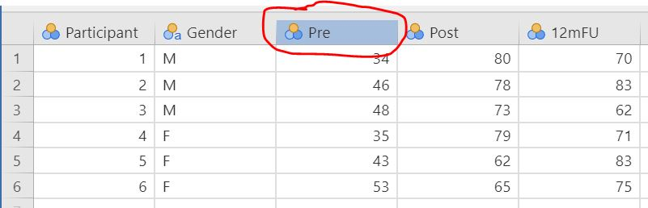
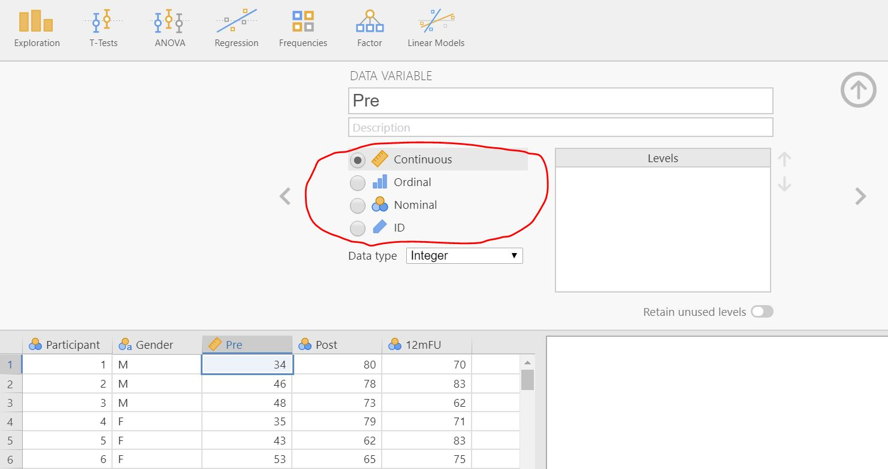
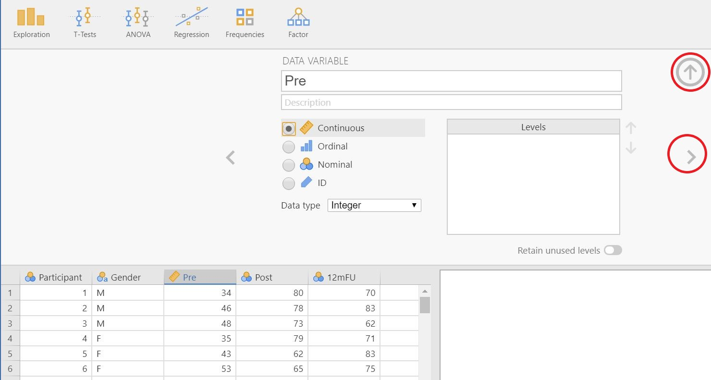

# Ange skalnivåer {#skalnivåer}

Innan analyser kan genomföras i jamovi behöver du oftast ange en <a href="https://sv.wikipedia.org/wiki/M%C3%A4tskala">skalnivå</a> för varje variabel som ingår i analysen. När data laddas in i jamovi får variablerna ofta den lägsta nivån (nominal). Det betyder att om du exempelvis vill göra ett two-sample t-test så behöver båda variablerna anges som "kontinuerliga". Notera att jamovi inte skiljer på intervall- och kvotdata, utan kategoriserar all kvantitativ data som kontinuerlig.

#### Hur du sätter skalnivån för en variabel {-}

1. Dubbelklicka på den variabel vars skalnivå du vill ändra.  
  

2. I variabel-fönstret, välj `ID`, `Nominal`, `Ordinal` eller `Continuous`.  
  

3. Klicka på uppåtpilen för att dölja variabelfönstret, eller klicka på vänster- eller högerpilen för att ändra en annan variabel.  
  

